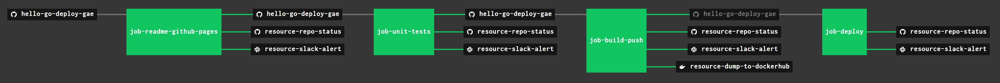

# hello-go-deploy-gae

```text
*** THE DEPLOY IS UNDER CONSTRUCTION - CHECK BACK SOON ***
For testing the deploy, I'm using using mesos/marathon.
```

[](https://goreportcard.com/report/github.com/JeffDeCola/hello-go-deploy-gae)
[](https://godoc.org/github.com/JeffDeCola/hello-go-deploy-gae)
[](https://codeclimate.com/github/JeffDeCola/hello-go-deploy-gae/maintainability)
[](https://codeclimate.com/github/JeffDeCola/hello-go-deploy-gae/issues)
[](http://jeffdecola.mit-license.org)

`hello-go-deploy-gae` _will test, build, push (to DockerHub) and deploy
a long running "hello-world" Docker Image to Google App Engine (gae)._

I also have other repos showing different deployments,

* [hello-go-deploy-aws](https://github.com/JeffDeCola/hello-go-deploy-aws)
* [hello-go-deploy-azure](https://github.com/JeffDeCola/hello-go-deploy-azure)
* hello-go-deploy-gae <- You are here!
* [hello-go-deploy-gce](https://github.com/JeffDeCola/hello-go-deploy-gce)
* [hello-go-deploy-gke](https://github.com/JeffDeCola/hello-go-deploy-gke)
* [hello-go-deploy-marathon](https://github.com/JeffDeCola/hello-go-deploy-marathon)

The `hello-go-deploy-gae`
[Docker Image](https://hub.docker.com/r/jeffdecola/hello-go-deploy-gae)
on DockerHub.

The `hello-go-deploy-gae`
[GitHub Webpage](https://jeffdecola.github.io/hello-go-deploy-gae/).

## PREREQUISITES

For this exercise I used go.  Feel free to use a language of your choice,

* [go](https://github.com/JeffDeCola/my-cheat-sheets/tree/master/software/development/languages/go-cheat-sheet)

To build a docker image you will need docker on your machine,

* [docker](https://github.com/JeffDeCola/my-cheat-sheets/tree/master/software/operations-tools/orchestration/builds-deployment-containers/docker-cheat-sheet)

To push a docker image you will need,

* [DockerHub account](https://hub.docker.com/)

To deploy to gae you will need,

* [google app engine (gae)](https://github.com/JeffDeCola/my-cheat-sheets/tree/master/software/platform-as-a-service/cloud-services-app/google-cloud-platform-cheat-sheet/google-app-engine.md)

As a bonus, you can use Concourse CI to run the scripts,

* [concourse](https://github.com/JeffDeCola/my-cheat-sheets/tree/master/software/operations-tools/continuous-integration-continuous-deployment/concourse-cheat-sheet)
  (Optional)

## EXAMPLES

There are a few examples in this repo.

* [EXAMPLE 1](https://github.com/JeffDeCola/hello-go-deploy-gae/tree/master/example-01-app)
  A simple hello world website.
* [EXAMPLE 2](https://github.com/JeffDeCola/hello-go-deploy-gae/tree/master/example-02-app)
  Static pages using gcloud.
* [EXAMPLE 3](https://github.com/JeffDeCola/hello-go-deploy-gae/tree/master/example-03-app)
  Service????

## RUN EXAMPLE 3

To run from the command line, ??????

```bash
cd example-03-app
go run main.go
```

Every 2 seconds `hello-go-deploy-gae` will print:

```bash
Hello everyone, count is: 1
Hello everyone, count is: 2
Hello everyone, count is: 3
etc...
```

## STEP 1 - TEST

Lets unit test the code,

```bash
go test -cover ./... | tee /test/test_coverage.txt
```

This script runs the above command
[/test/unit-tests.sh](https://github.com/JeffDeCola/hello-go-deploy-gae/tree/master/test/unit-tests.sh).

This script runs the above command in concourse
[/ci/scripts/unit-test.sh](https://github.com/JeffDeCola/hello-go-deploy-gae/tree/master/ci/scripts/unit-tests.sh).

## STEP 2 - BUILD (DOCKER IMAGE)

Lets build a docker image from your binary `/bin/hello-go`.

First, create a binary `hello-go`,
I keep my binaries in `/bin`.

```bash
go build -o bin/hello-go main.go
```

Copy the binary to `/build-push` because docker needs it in
same directory as Dockerfile,

```bash
cp bin/hello-go build-push/.
cd build-push
```

Build your docker image from binary `hello-go`
using `Dockerfile`,

```bash
docker build -t jeffdecola/hello-go-deploy-gae .
```

Obviously, replace `jeffdecola` with your DockerHub username.

Check your docker images on your machine,

```bash
docker images
```

It will be listed as `jeffdecola/hello-go-deploy-gae`

You can test your dockerhub image,

```bash
docker run jeffdecola/hello-go-deploy-gae
```

This script runs the above commands
[/build-push/build-push.sh](https://github.com/JeffDeCola/hello-go-deploy-gae/tree/master/build-push/build-push.sh).

This script runs the above commands in concourse
[/ci/scripts/build-push.sh](https://github.com/JeffDeCola/hello-go-deploy-gae/tree/master/ci/scripts/build-push.sh).

## STEP 3 - PUSH (TO DOCKERHUB)

Lets push your docker image to DockerHub.

If you are not logged in, you need to login to dockerhub,

```bash
docker login
```

Once logged in you can push,

```bash
docker push jeffdecola/hello-go-deploy-gae
```

Check you image at DockerHub. My image is located
[https://hub.docker.com/r/jeffdecola/hello-go-deploy-gae](https://hub.docker.com/r/jeffdecola/hello-go-deploy-gae).

This script runs the above commands
[/build-push/build-push.sh](https://github.com/JeffDeCola/hello-go-deploy-gae/tree/master/build-push/build-push.sh).

This script runs the above commands in concourse
[/ci/scripts/build-push.sh](https://github.com/JeffDeCola/hello-go-deploy-gae/tree/master/ci/scripts/build-push.sh).

## STEP 4 - DEPLOY (TO GAE)

Refer to my
[gae cheat sheet](https://github.com/JeffDeCola/my-cheat-sheets/blob/master/software/infrastructure-as-a-service/cloud-services-compute/google-cloud-platform-cheat-sheet/google-app-engine.md),
for more detailed information and a nice illustration.

The goal is to deploy a ??? from a ???.

There are ?? steps to deployment on gae,

* tbd
* tbd

This script ???
[/gae-deploy/????.sh](https://github.com/JeffDeCola/hello-go-deploy-gae/tree/master/gae-deploy/???.sh).

Lastly, this script runs all of the above commands in concourse
[/ci/scripts/deploy.sh](https://github.com/JeffDeCola/hello-go-deploy-gae/tree/master/ci/scripts/deploy.sh).

## CHECK THAT hello-go is RUNNING IN APP ENGINE

tbd

## A HIGH LEVEL VIEW OF GAE

Here is an illustration how everything fits together.


## TEST, BUILT, PUSH & DEPLOY USING CONCOURSE (OPTIONAL)

For fun, I use concourse to automate the above steps.

A pipeline file [pipeline.yml](https://github.com/JeffDeCola/hello-go-deploy-gae/tree/master/ci/pipeline.yml)
shows the entire ci flow. Visually, it looks like,



The `jobs` and `tasks` are,

* `job-readme-github-pages` runs task
  [readme-github-pages.sh](https://github.com/JeffDeCola/hello-go-deploy-gae/tree/master/ci/scripts/readme-github-pages.sh).
* `job-unit-tests` runs task
  [unit-tests.sh](https://github.com/JeffDeCola/hello-go-deploy-gae/tree/master/ci/scripts/unit-tests.sh).
* `job-build-push` runs task
  [build-push.sh](https://github.com/JeffDeCola/hello-go-deploy-gae/tree/master/ci/scripts/build-push.sh).
* `job-deploy` runs task
  [deploy.sh](https://github.com/JeffDeCola/hello-go-deploy-gae/tree/master/ci/scripts/deploy.sh).

The concourse `resources type` are,

* `hello-go-deploy-gae` uses a resource type
  [docker-image](https://hub.docker.com/r/concourse/git-resource/)
  to PULL a repo from github.
* `resource-dump-to-dockerhub` uses a resource type
  [docker-image](https://hub.docker.com/r/concourse/docker-image-resource/)
  to PUSH a docker image to dockerhub.
* `resource-marathon` users a resource type
  [docker-image](https://hub.docker.com/r/ckaznocha/marathon-resource)
  to DEPLOY the newly created docker image to marathon.
* `resource-slack-alert` uses a resource type
  [docker image](https://hub.docker.com/r/cfcommunity/slack-notification-resource)
  that will notify slack on your progress.
* `resource-repo-status` uses a resource type
  [docker image](https://hub.docker.com/r/dpb587/github-status-resource)
  that will update your git status for that particular commit.

For more information on using concourse for continuous integration,
refer to my cheat sheet on [concourse](https://github.com/JeffDeCola/my-cheat-sheets/tree/master/software/operations-tools/continuous-integration-continuous-deployment/concourse-cheat-sheet).
